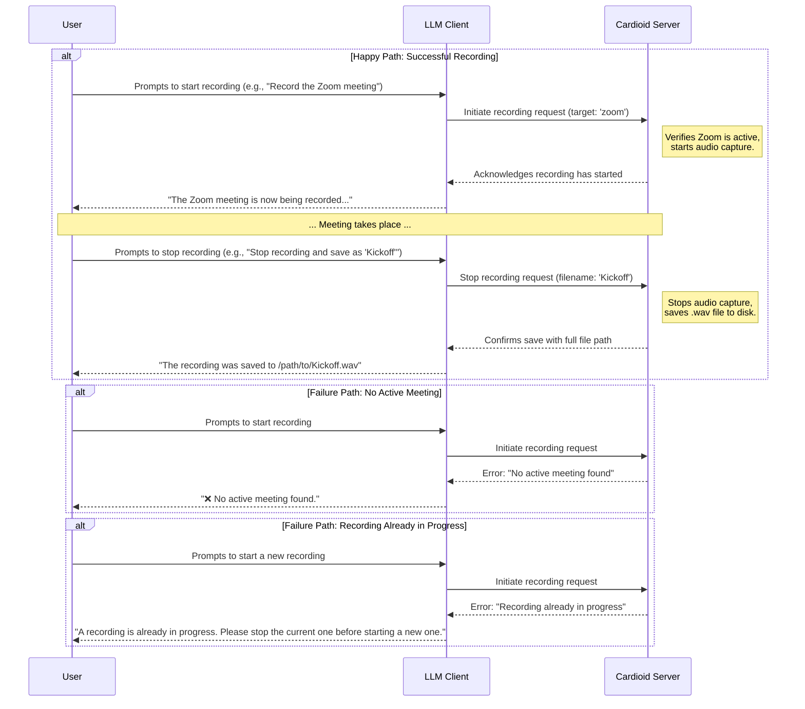

# Product Requirements Document: Cardioid

* **Author:** Adam Veldhousen
* **Status:** Approved
* **Last Updated:** June 7, 2025

## 1. Overview & Background 📝

### 1.1. Problem Statement
Professionals across various roles (like product managers, developers, and designers) struggle with a fragmented workflow for capturing information during meetings. They are forced to juggle separate applications for communication, manual note-taking, and AI-powered transcription.

This leads to several direct negative impacts:
* **Distracting Context-Switching:** Moving between applications breaks concentration and meeting flow.
* **Divided Attention:** Users are forced to choose between actively listening and diligently taking notes, often failing to do either perfectly.
* **Inaccessible Information:** The original meeting audio and raw transcripts are often not easily available for later review, making it difficult to recall specific details or context.

This inefficient process diminishes the value of meetings, leading to lost information and wasted time.

### 1.2. Vision & Solution
**Vision:** Our vision is to create a meeting experience where users can remain fully present and focused on the conversation, confident that critical information is being captured without distracting them from what's most important: each other.

**Solution:** We will achieve this by creating Cardioid, a model context protocol server that seamlessly integrates with a user's LLM client of choice. This server will enable one-click meeting recording directly within their existing AI-powered workflow, eliminating the need for separate apps and removing the friction between active participation and perfect recall.

### 1.3. Target Audience
**Operating Environment:** The target users for Cardioid primarily operate within **remote-first organizations** that emphasize asynchronous collaboration and aim to maximize the value of synchronous meetings while reducing meeting fatigue.

**Primary Users:** These are the hands-on users for whom the product is designed.
* **The Meeting Facilitator:** Their main goal is to capture action items and key decisions accurately without disrupting the meeting's natural flow.
* **The Interviewer:** Their primary need is to focus completely on the candidate's responses and foster a connection, rather than being distracted by manual note-taking.
* **The Direct Report:** Their goal is to accurately recall detailed feedback, instructions, or project details from 1-on-1 meetings with their manager.

**Secondary Users:** These users are impacted by and interact with the output of Cardioid.
* **The Asynchronous Team Member:** A colleague who could not attend a meeting live and relies on Cardioid's output (recording and transcript) to stay fully informed and contribute.
* **The Project Manager:** A stakeholder who reviews transcripts from technical or team meetings they didn't attend to extract requirements, decisions, and timelines.
* **The AI Agent:** An autonomous software agent that will use the Cardioid-provided audio as a source for its own processing tasks, such as transcription, summarization, or analysis. (This is based on the hypothesis that AI agents will become increasingly prevalent users of data streams within business processes).

## 2. Goals & Success Metrics 📊

### 2.1. Project Goals
* Improve the quality and completeness of information captured from meetings.
* Increase the accessibility of high-quality meeting recording by providing a free and open-source solution.
* Foster adoption and establish Cardioid as a key component within the open-source AI and Model Context Protocol ecosystem.
* Enable AI agents to participate in and process meetings in a seamless, non-disruptive manner.
* Reduce the cognitive load on human participants, freeing them to be more present, authentic, and engaged in the conversation.

### 2.2. Success Metrics (KPIs)
**Adoption & Integration (Target: First 3 Months)**
* **Known Integrations:** Achieve at least 3 public integrations with LLM clients or open-source projects.

**Primary User Experience (Target: 3 Months Post-Launch)**
* **Focus Improvement:** Achieve an average user rating of 4.0/5.0 or higher on the question: "How much has Cardioid improved your ability to focus during meetings?"
* **Retention Improvement:** Achieve an average user rating of 4.0/5.0 or higher on the question: "How much has Cardioid improved your ability to retain information from meetings?"
* **Low Disruption:** Achieve an average user rating of 2.0/5.0 or lower on the question: "How disruptive is it for Cardioid to record the meetings you attend?"

**Secondary User Experience (Target: 3 Months Post-Launch)**
* **Asynchronous Knowledge Transfer:** Achieve an average user rating of 4.0/5.0 or higher on the question: "How much has Cardioid improved your ability to gain knowledge from meetings you did not attend?"

## 3. User Stories & Requirements 📋

**Epic: Core Meeting Recording Functions**

* **User Story 1:** As a Meeting Facilitator, I want to command my LLM client to record a Zoom meeting, so that I can have the audio available for later review and processing.
    * **Acceptance Criteria:**
        * **Scenario: Successful Recording Start**
            * **Given** I am in an active Zoom call,
            * **And** the Cardioid server is running and connected to my LLM client,
            * **When** I send a prompt to my LLM client to record the meeting,
            * **Then** the Cardioid server begins recording the system audio,
            * **And** I receive a confirmation message in my LLM client, such as "✅ Recording has started."
        * **Scenario: No Active Meeting**
            * **Given** I am **not** in an active Zoom call,
            * **When** I send a prompt to my LLM client to record a meeting,
            * **Then** I receive an error message, such as "❌ No active meeting found."

* **User Story 2:** As a Meeting Facilitator, I want to command my LLM client to stop a recording, so that the audio is saved for later use.
    * **Acceptance Criteria:**
        * **Scenario: Successful Stop with Custom Filename**
            * **Given** a recording is in progress,
            * **When** I prompt the LLM to stop recording and provide a custom filename (e.g., "Stop recording, save as 'My Project Kickoff'"),
            * **Then** the Cardioid server saves the audio as a `.wav` file with the specified name.
            * **And** the user receives a confirmation message in their LLM client that includes the full path to the saved file.
        * **Scenario: Successful Stop with Default Filename**
            * **Given** a recording is in progress,
            * **When** I prompt the LLM to stop recording without providing a custom filename,
            * **Then** the Cardioid server saves the audio as a `.wav` file with a default, timestamped name (e.g., `Cardioid-Recording-2025-06-07-210616.wav`).
            * **And** the file is saved in the path defined by the `CARDIOID_OUTPUT_DIRECTORY` environment variable, if set.
            * **And** if the variable is not set, the file is saved in the `~/.cardioid_recordings` directory by default.
            * **And** the user receives a confirmation message in their LLM client that includes the full path to the saved file.
        * **Scenario: Save Fails**
            * **Given** a recording is being stopped,
            * **And** the file cannot be saved for any reason (e.g., insufficient disk space, invalid path),
            * **Then** the user receives a clear error message in their LLM client explaining the reason for the failure.
        * **Scenario: No Active Recording**
            * **Given** no recording is in progress,
            * **When** I prompt the LLM to stop recording,
            * **Then** the user receives a message indicating that no recording was active.

## 4. Non-Functional Requirements ⚙️

* **Performance**
    * **Recording Latency:** The system must begin recording within 5 seconds of receiving the command from the LLM client.
    * **CPU Usage:** The Cardioid server process must consume less than 5% of the CPU during active recording on a standard user machine.
    * **Memory Usage:** The Cardioid server process must consume less than 1 GB of RAM.
    * **Recording Stability:** The system must support continuous recording sessions of up to 2 hours without crashing or exceeding the defined CPU and memory limits.

* **Security**
    * **Data at Rest:** Audio files will be stored unencrypted on the user's local filesystem. The security of the host machine is considered the user's responsibility.
    * **Data in Transit:** The Cardioid server operates locally and, for the initial version, will not transmit audio files over any network. All audio is written directly to the local filesystem.
    * **Access Control:** File permissions for saved `.wav` files are managed by the operating system. Cardioid will set file permissions to allow read/write access for the user who created the file and read-only access for their associated group (`user=rw, group=r`).

* **Accessibility**
    * **Client Messages**
        * All user-facing messages sent to the LLM client must be fully descriptive and must not rely on color or visual cues alone for meaning.
        * Success messages for saved recordings must always include the complete, absolute file path.
    * **Documentation & Developer Experience**
        * To ensure ease of installation, the server will be provided as an NPM package built with TypeScript/Node.js, allowing for direct use with `npx`.
        * All public documentation will be structured with clear headings and written in accessible language.
        * All configuration options will be clearly documented, detailing their purpose, acceptable values, and default settings.
    * **Configuration**
        * All configuration of the server must be managed via environment variables.
        * All configuration options must be optional, with sensible default values that work on a wide variety of systems without user intervention.

* **Scalability**
    * **Concurrency:** The system will support only one active recording session at a time. If a user attempts to start a new recording while one is in progress, they will receive the error message: "A recording is already in progress. Please stop the current one before starting a new one."
    * **Performance Over Time:** The performance of the Cardioid server must not degrade as the number of saved recordings in the output directory increases. The only anticipated limiting factor is the available disk space on the host machine.
    * **Architectural Scope:** The architecture is designed exclusively for a single instance running on a local user machine. Scaling to support multiple instances or a multi-tenant cloud service is explicitly out of scope for this version.

## 5. Design & User Experience (UX) 🎨

### 5.1. User Flow Diagram
**Description:** The following diagram illustrates the sequence of interactions between the User, their LLM Client, and the Cardioid Server for the core recording workflow.

**Mermaid Sequence Diagram Code:**

### 5.2. Wireframes
The text-based interaction examples defined in the Acceptance Criteria for the User Stories in Section 3 will serve as the low-fidelity wireframes for this project. They define the core information architecture of the user-facing messages.

### 5.3. High-Fidelity Mockups & Prototype
The detailed success and error messages defined in the User Stories and User Flow Diagram will serve as the high-fidelity 'mockups' of the final text interface. The first functional version of the server that correctly implements these interactions will be considered the prototype.

## 6. Release & Launch Plan 🚀

### 6.1. Phasing
* **Phase 1: Alpha**
    * **Audience:** Author only.
    * **Actions:** The author will use Cardioid for all personal and professional meetings.
    * **Goal:** To validate core functionality and stability in a primary real-world environment ("dogfooding").
* **Phase 2: Private Beta**
    * **Audience:** Internal colleagues and other trusted users.
    * **Actions:** Share the project in select internal company channels for feedback.
    * **Goal:** To gather feedback on usability, the installation process, and overall value. To identify and fix bugs across different machine configurations before a public launch.
* **Phase 3: General Availability (GA)**
    * **Audience:** The public.
    * **Actions:** Release the official 1.0 version.
    * **Goal:** To launch the product and begin driving widespread adoption within the target developer and open-source communities.

### 6.2. Marketing & Communications
* **Private Beta Phase Communication**
    * **Channel:** Internal company communication tools (e.g., Slack).
    * **Message:** An informal, descriptive message will be shared with colleagues, explaining the project's workflow and inviting them to try the tool and provide early feedback.
* **General Availability (GA) Phase Communication**
    * **Channels:** Hacker News, the author's personal blog, Product Hunt, and relevant friends/communities on Discord.
    * **Core Message/Headline:** The launch will be announced with the headline: "Show HN: I built a free, open-source server to record meetings directly from any LLM client."

### 6.3. Support & Community Management
* **Support Channels:** All user support, including questions, bug reports, and feature requests, will be managed via the project's **GitHub Issues** and **GitHub Discussions** tabs. Initial feedback may also be gathered from the public launch threads (e.g., on Hacker News).
* **Contribution Guidelines:** A `CONTRIBUTING.md` file will be included in the repository to guide developers who wish to contribute. It will outline the process for submitting pull requests and other technical requirements.
* **Community Code of Conduct:** The project will adopt a standard Code of Conduct to foster a welcoming and inclusive community. A link to the Code of Conduct will be included in the `CONTRIBUTING.md` file.

## 7. Scope & Limitations 🚧

### 7.1. Assumptions
* **User Technical Proficiency:** Users are assumed to be technically capable of installing and running a local server from the command line, configuring environment variables, and troubleshooting basic setup issues.
* **Local Environment:** The Cardioid server is assumed to be running on the same local machine that the user is using to join and participate in video meetings.
* **User Intent:** We assume that the target user wants to integrate audio recording and processing into their existing LLM client workflow.
* **Downstream Tooling:** Users are assumed to have their own methods and tools for utilizing the output `.wav` files (e.g., transcription services, audio players).
* **Host Machine Security:** The user's local machine is assumed to be a secure environment, and the user is responsible for its security.

### 7.2. Dependencies
* **Meeting Software:** The initial version is dependent on the user running **Zoom** for meeting detection.
* **Runtime Environment:** Cardioid requires a compatible version of the **Node.js runtime** and **NPM** to be installed on the user's machine.
* **LLM Client Capabilities:** The user's LLM client must support **"tool calls"** (or function calls) to enable interaction with the local Cardioid server.
* **Audio Capture Engine:** The system depends on a **headless Electron process** running in the background to access the necessary system-level APIs for capturing audio.

### 7.3. Out of Scope
* **Support for other meeting platforms:** Support for Google Meet, Microsoft Teams, Slack, etc., is out of scope. The focus is exclusively on Zoom.
* **Graphical User Interface (GUI):** A visible menu bar icon or any form of GUI is out of scope. The application will be entirely headless.
* **Cloud Storage Integration:** Saving files directly to cloud services like Google Drive or S3 is out of scope.
* **Built-in Audio Transcription:** The server's responsibility is to record and save the audio file. It will not perform any transcription.
* **Multi-instance Scaling:** The server is designed for a single local instance and will not support multi-tenant or cloud-based scaling.

## 8. Future Considerations & V-Next 🔮
* **Expanded Platform Support:** After the initial launch, add support for other meeting platforms like Google Meet, Microsoft Teams, and Slack.
* **Cloud Storage Integration:** Design the storage backend to be swappable or plugin-based, allowing for future integration with services like Google Drive, S3-compatible storage, or generic webhooks.
* **Built-in Transcription Services:** Integrate directly with a remote transcription service, such as the OpenAI Whisper API, to provide transcripts automatically.
* **Graphical User Interface (GUI):** Introduce a menu bar or system tray icon to provide a visual indicator of recording status and duration, and potentially offer quick-access controls.

## 9. Questions & Open Items 🤔
* What is the specific minimum version of Node.js we will support?
* What is the strategy for notifying users about future updates?
* Should the 2-hour meeting duration limit be increased in the future?
* Should we capture telemetry from usage to drive future feature development decisions?
* Which platforms do I support? (MacOS first, Linux? Windows?)
